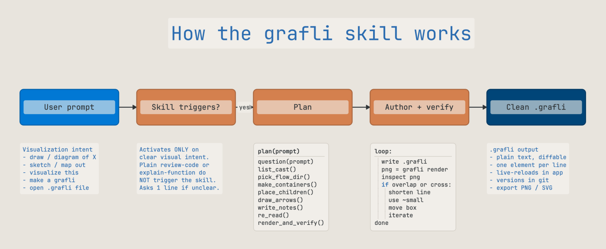

# Pair grafli with your AI

grafli isn't just a diagram editor — it's the canvas your coding agent
uses to **communicate complex systems back to you**. A `.grafli` file
is plain text, line-oriented, and small enough that an LLM can read,
modify, and produce it in seconds. The bundled grafli **skill**
teaches the agent how to do that *well*.



The diagram above is itself a `.grafli` (`examples/skill-explained.grafli`)
authored under the same skill it describes — meta-correct, and a small
demonstration that the workflow holds.

## Why a skill is needed

Without guidance, a generic LLM will invent broken `.grafli` syntax,
fight the renderer's layout model, and produce diagrams that look
plausible in the conversation but render as overlapping boxes and
crossed arrows in the actual app.

The skill gives the agent:

- **A planning loop** — "what question does the diagram answer?"
  before any boxes get placed, so the diagram has a point.
- **Layout discipline** — grid alignment, container margin model,
  flow direction, fan-out handling, the typography scale, and the
  zoomed-out (semantic-zoom) reading as a second thing to author.
- **Collaboration etiquette** — working `T:`/`Q:` notes on a shared
  board, minimal diffs, proposals instead of unilateral restructuring.
- **Code-mode authoring style** — predicate-style names, contract
  keywords for review focus, when to use a code-block versus split
  the logic into multiple nodes.
- **Presentation authoring** — flows, scoped stops, text slides,
  container-as-slide composition, PDF/PPTX export incl. templates.
- **Thinking-board patterns** — decision boards, tension maps,
  question landscapes, and the deliberate-incompleteness rules that
  keep the board a tool for *your* thinking.
- **Common-mistakes checklist** — quote escaping, disconnected nodes,
  truncated labels, deprecated keywords. The things that recur.

It's structured as a lean, always-loaded core (`SKILL.md` — triggers,
workflow, etiquette, checklist) plus `references/` files the agent
reads on demand (full format tables, design principles, presenting,
thinking boards) — deep coverage without a heavyweight prompt.

## Install

The skill ships **inside the Python package** as a directory —
`SKILL.md` plus its `references/` files. The built-in installer places
it where your AI tool expects skills:

```bash
# Install for one or all supported tools (copies SKILL.md + references/)
grafli skill install claude
grafli skill install all

# Report install status per tool (and whether a newer version shipped)
grafli skill check

# Single-file consumers: stdout is the FULL skill, references inlined
grafli skill -o GRAFLI-SKILL.md
grafli skill --core          # just the lean core, no references

# Print the path of the bundled skill directory (so you can symlink it)
grafli skill --where
```

| AI tool | Where the skill goes | Docs |
|---------|---------------------|------|
| Claude Code | `~/.claude/skills/grafli/` (or per-project under `.claude/skills/...`) | <https://code.claude.com/docs/en/skills> |
| Codex | `~/.agents/skills/grafli/` | <https://developers.openai.com/codex/skills> |
| OpenCode | `~/.config/opencode/skills/grafli/` (also reads the claude/codex paths) | <https://opencode.ai/docs/skills> |

`grafli skill check` compares the installed version against the
packaged one, so re-running `grafli skill install` after
`pip install --upgrade grafli` keeps agents on the latest skill. A
symlink to `grafli skill --where` works too if your platform supports
it comfortably.

## What the skill triggers on

The skill is deliberately **scoped narrowly** to avoid polluting
unrelated conversations. It activates on **explicit visualization
requests** — phrases like:

- "draw a diagram of …"
- "visualize the …"
- "sketch / map out / graph this"
- "make a grafli for …"
- working on existing `.grafli` files

It also activates when you ask the agent to **explain, walk through, or
present** an existing graph — it authors a [flow](bookmarks-flows.md): an
ordered sequence of saved viewpoints with narration, so a big diagram is
taught as a guided tour (playable in-app, presentable fullscreen, exportable
to PDF / PPTX slides) instead of dumped all at once.

And it activates on **thinking-board requests** — "help me think
through X", "weigh the options", "map out the unknowns" — the moments a
human explainer would walk to a whiteboard. The agent then authors a
board that structures the problem (a decision board, a tension map, a
question landscape) rather than one that documents a system.

It does **not** activate on generic "review this code", "explain this
function", or "summarize this module" requests unless the user also
asks for a visual, a board, or a diagram. Keeping the trigger tight
keeps your agent fast and focused on the task at hand.

## A typical session

Once the skill is installed, the agent:

1. Listens for a visualization request.
2. Asks any clarifying question (the planning loop).
3. Produces a `.grafli` file using `Write`.
4. Verifies its own work headlessly: `grafli render` (with `--focus`,
   `--lod`, and `--bookmark` for targeted looks), `grafli fmt` to
   normalize what it wrote into the same canonical form the app saves
   (integer coordinates, canonical spacing — keeps diffs clean),
   `grafli diagnose`
   (incl. `parse-error` findings for lines that would silently drop),
   `grafli inspect` for placement geometry, and `grafli export --check`
   when a deck is involved. `grafli diagnose --fix` applies the
   mechanical corrections (clamping, sizing, mistyped tokens) and exits
   non-zero while errors remain, so the loop can run unattended — what
   needs a judgment call is left for the agent to decide.
5. Iterates on the layout / labels based on feedback.

The agent's output is just text. You can edit it, diff it, version it,
and re-render any time. There is no proprietary format or cloud
service in the loop.

## Render-on-demand for your CI

Because `grafli render` is a non-interactive subcommand, your CI can
re-render diagrams on every push:

```bash
grafli render docs/architecture.grafli docs/architecture.svg
```

Pair this with a markdown reference to the SVG and the diagram in
your design doc stays in sync with the source — the same workflow as
docs-as-code, but for system pictures.

## Combining the skill with code-mode notes

The skill encourages **graph + code-mode** as the default pattern for
review-oriented diagrams: the graph carries *who calls whom*, while
each box has a 5–9 line code-mode note describing *what one function
does*. Together they answer questions neither could answer alone:

- Where could an open redirect hide? (graph locates the box, code
  note shows the `risk` line.)
- What contracts are covered by tests? (`verify:` arrows from a tests
  box mirror the `verify:` lines inside each code-mode note.)
- What's the failure mode of this saga? (each `pre` / `post` / `risk`
  contract is visible at a glance.)

This pattern is the headline differentiator versus generic diagram
tools — and the skill is what gets your agent to produce it cleanly
from a one-line prompt.
