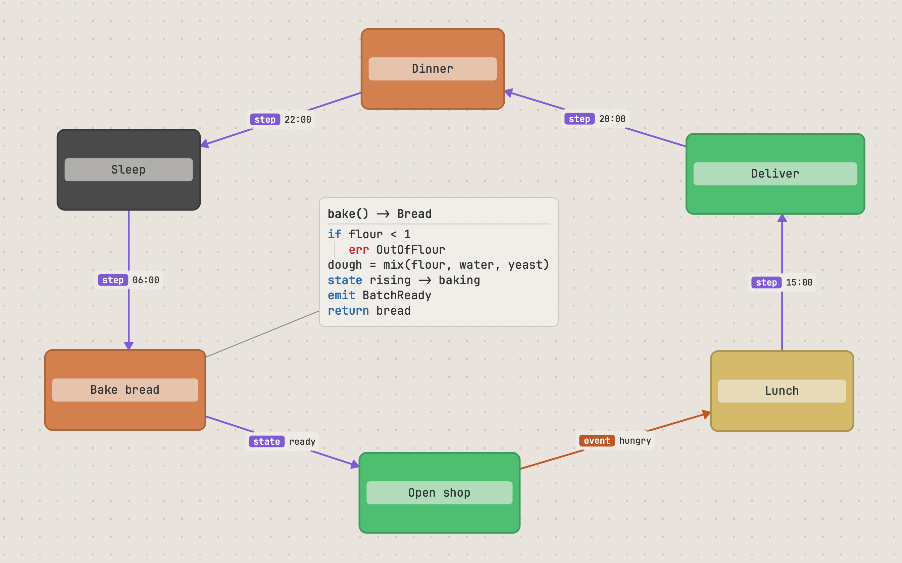
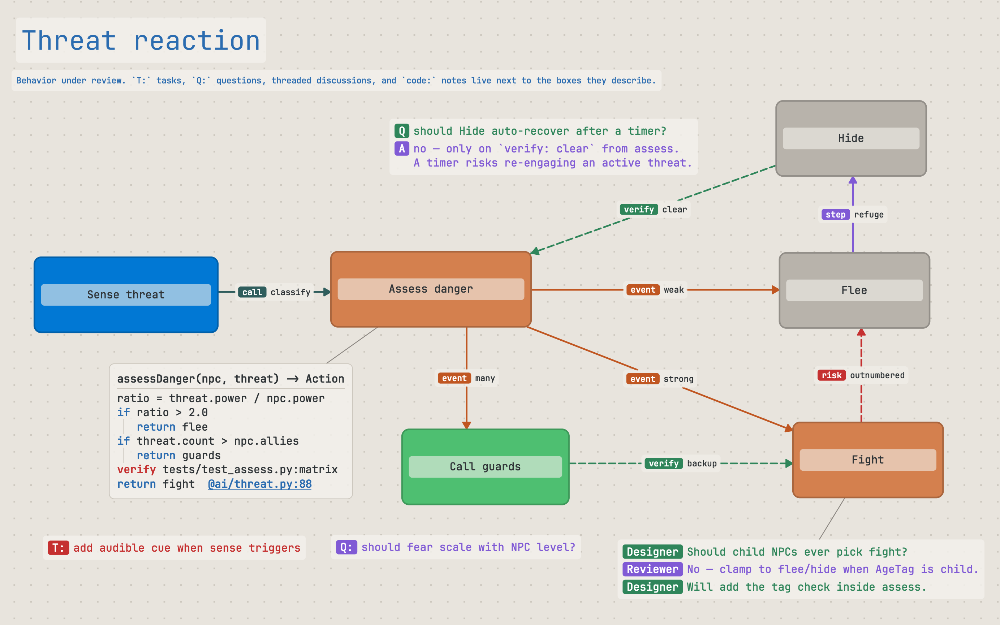
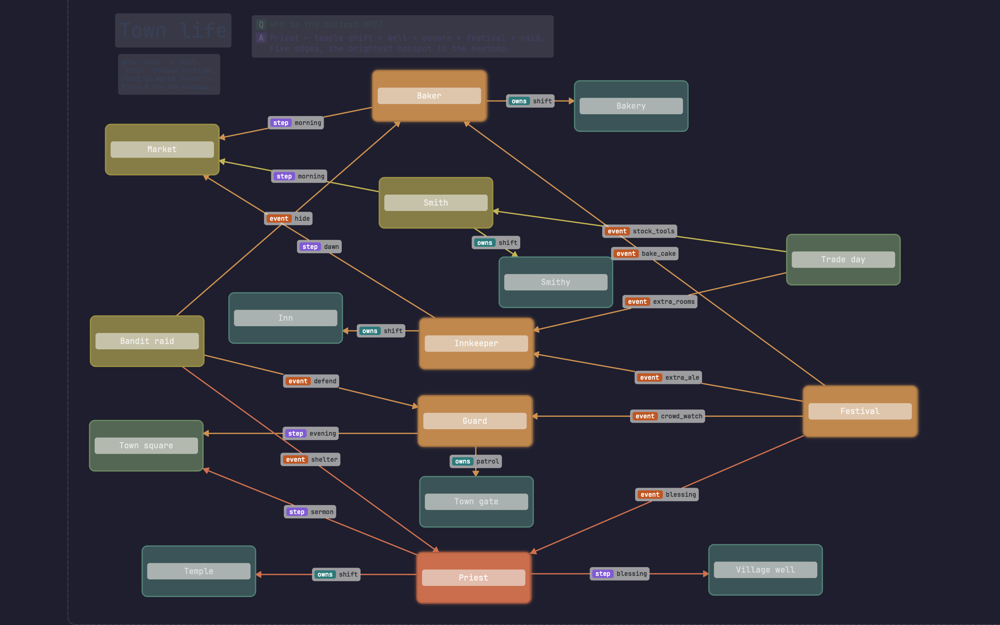
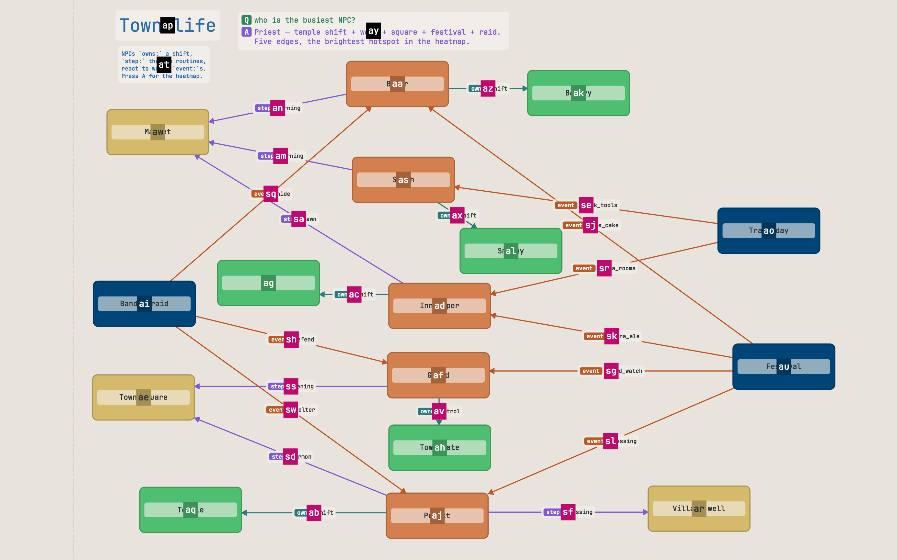

---
hide:
  - navigation
  - toc
---

<div class="grafli-hero" markdown>

# grafli

<p class="grafli-tagline">
A keyboard-driven, plain-text diagram tool for people who think faster than they click.
</p>

<div class="grafli-cta" markdown>

[Install grafli :material-download:](#install){ .md-button .md-button--primary }
[GitHub :material-github:](https://github.com/MisterGC/grafli){ .md-button }
[PyPI :material-package:](https://pypi.org/project/grafli/){ .md-button }

</div>

</div>



## Why grafli

<div class="grafli-pillars" markdown>

<div class="grafli-pillar" markdown>
### Keyboard-first
Modal editing, vim muscle memory. Four primary modes — Select, Rect, Text, Connect — and you build entire diagrams without ever reaching for the mouse.
</div>

<div class="grafli-pillar" markdown>
### Less is more
A small, deliberate set of primitives — boxes, arrows, notes — composes into anything from a quick sketch to a layered architecture diagram. No menus to discover, no themes to fight.
</div>

<div class="grafli-pillar" markdown>
### Text for AI, git, humans
`.grafli` files are line-oriented plain text. Diffs make sense. LLMs can read and write them. You can edit them in your editor of choice. No binary blobs, no cloud lock-in.
</div>

<div class="grafli-pillar" markdown>
### AI-native
Ship the bundled skill into Claude Code, OpenCode, or Codex CLI with one command — your agent learns the format, the layout discipline, and the planning loop that produces clear diagrams. [Read more →](ai.md)
</div>

</div>

## A file format you can read

```text
@ box sleep   "Sleep"       60,180  160x90 %subtle
@ box bake    "Bake bread" 240,180  180x90 %accent
@ box shop    "Open shop"  440,180  180x90 %tertiary
@ box deliver "Deliver"    640,180  200x90 %tertiary

@ arrow sleep -> bake "step: 06:00"
@ arrow bake  -> shop "state: ready"
@ arrow shop  -> deliver "event: orders_pending"

@ note bake_code 240,310 """
code:
bake() -> Bread
if flour < 1:
  err OutOfFlour
dough = mix(flour, water, yeast)
state rising -> baking
emit BatchReady
return bread
"""
```

One element per line. Stable IDs. Diffs that highlight what actually changed. The format is small enough to learn in a sitting and structured enough that an LLM can produce a valid diagram from a prompt.

- **Human-readable** — nothing is encoded; you can hand-edit any element.
- **Git-native** — line-oriented diffs reflect intent.
- **AI-ready** — LLMs reliably emit and modify the format from natural language.
- **External edits welcomed** — grafli watches the file and reloads automatically.

## Annotate with intent

Notes aren't just sticky labels. Grafli recognizes lightweight conventions and renders them with visual weight that matches their meaning.

- **Tasks** (`T:` / `TODO:`) and **questions** (`Q:` / `QUESTION:`, both case-insensitive) get distinct colors so review work is visible at a glance.
- **Discussions** (`AI:` / `Reviewer:` …) format as threaded conversation bubbles inside a single note.
- **Code-mode notes** (lines starting with `code:`) render minimal pseudocode: a bold function signature on the first line, blue **flow** keywords (`if`, `for`, `call`, `emit`, …), red **contract** keywords (`pre`, `post`, `verify`, `risk`, …), and clickable `@file:line` refs that open in your editor.
- **Markdown-mode notes** (lines starting with `md:` / `markdown:`) render a small subset of GitHub-flavoured Markdown — headings, lists, click-to-toggle task checkboxes, blockquotes, inline emphasis, and clickable links.
- **Semantic edge labels** — prefixes like `call:`, `data:`, `event:`, `verify:`, `risk:` render as colored chips on the arrow itself.
- **Connector routing** — leave a connector straight, or give it `!spline` for a curve and `!ortho` for a right-angle stair that slides clear of boxes in its way. Anchors are worked out from the layout, never written into the file, so the same board renders the same in the app and on the command line.
- **Markdown resources** — attach a markdown note to any element and edit it in [textli](https://mistergc.github.io/textli/), grafli's full-window Markdown editor (its own project, bundled as a dependency).
- **Scratch board** — start `grafli` with no file and you land on a persistent `~/grafli-scratch.grafli`, autosaved like any other board.



## Read complex diagrams

Real diagrams sprawl. A handful of view-toggles turn a busy diagram into a focused one — combine them at will.

- **Subgraph focus** — <kbd>B</kbd> on a node fades everything that isn't reachable from it. Cycle through *all incoming* / *outgoing* / *both* directions; toggle 1-hop vs unlimited depth with <kbd>Shift</kbd>+<kbd>B</kbd>.
- **Complexity heatmap** — <kbd>A</kbd> colors every node by how many connections, parents, and children it has. Hot nodes glow; cold nodes fade. Find the parts of a diagram that need refactoring without reading every label.
- **Dim connectors** (<kbd>,</kbd>) and **dim notes** (<kbd>Shift</kbd>+<kbd>N</kbd>) — fade arrows or text-notes to 8% opacity to read the rest. Same buttons in the side panel's *View* section.
- **Minimap** (<kbd>M</kbd>) — a corner overview shows boxes, notes, and connector density so you can spot hot regions and re-orient on a large canvas.



## Navigate diagrams that grew

- **Jump labels** (<kbd>Ctrl</kbd>+<kbd>J</kbd>) — every visible item gets a one-or-two-key label; press it to select.
- **Search** (<kbd>/</kbd>) by label, fuzzy-matched.
- **Graph navigation** — hold <kbd>Alt</kbd>, see connector keys, follow edges chord by chord.
- **Hierarchy traversal** — <kbd>g</kbd><kbd>p</kbd> parent, <kbd>g</kbd><kbd>c</kbd> first child, <kbd>Tab</kbd> cycle siblings, with a breadcrumb in the status bar.
- **Focus loop** — <kbd>g</kbd><kbd>z</kbd> zooms the selection to fill the screen and flies you back again, for a tight overview → edit → overview rhythm.
- **Jumplist** (<kbd>Ctrl</kbd>+<kbd>O</kbd> / <kbd>Ctrl</kbd>+<kbd>I</kbd>) — vim-style viewport history.
- **Sub-graflis** — link any node to a deeper diagram in its own file. Click through, edit, return.



[Read more →](navigating.md)

## Explain a graph as a guided tour

A big diagram doesn't have to land all at once. **Bookmarks** save labeled
viewpoints; **flows** string them into a guided tour you can step through,
auto-play, present fullscreen, or export as a slide PDF.

- **Semantic anchors** — a bookmark frames *item ids*, not pixel coordinates,
  so it stays correct after you move boxes around.
- **Frictionless capture** — <kbd>g</kbd><kbd>b</kbd> bookmarks what's on
  screen; <kbd>g</kbd><kbd>f</kbd> records a flow as you navigate.
- **Present & export** — <kbd>F5</kbd> presents a flow like a slide deck;
  `grafli export … --flow` writes a PDF for people who don't run grafli.
- **AI-authorable** — because it's plain text, your agent can write an
  explanatory tour through a graph instead of dumping the whole thing.

[Read more →](bookmarks-flows.md)

## Where grafli fits

<div class="grafli-pillars" markdown>

<div class="grafli-pillar" markdown>
### System architecture
Lay out services, data flows, and ownership lines with semantic edge labels that survive into the file format.
</div>

<div class="grafli-pillar" markdown>
### Code review notes
Attach `T:` / `Q:` annotations and code-mode pseudocode summaries to any element. Pair the diagram with the PR.
</div>

<div class="grafli-pillar" markdown>
### Brainstorming
Modal creation is fast enough to keep up with thinking. Refactor by selection, not redrawing.
</div>

<div class="grafli-pillar" markdown>
### Living design docs
Embed a `.grafli` next to your markdown. Diff it. Render it on demand. Treat diagrams like the code they describe.
</div>

</div>

## Install { #install }

```bash
pip install grafli
grafli my-diagram.grafli
grafli                      # no file? opens your scratch board
```

Requirements: Python 3.12+, PySide6 (Qt 6.7+).

Yank the diagram as PNG to your clipboard with <kbd>Y</kbd>; export SVG with <kbd>Ctrl</kbd>+<kbd>E</kbd>. Auto-save flushes within 300 ms. Press <kbd>F1</kbd> in-app for the full keybinding cheat sheet and text-annotation reference.

## Project

- [Source on GitHub](https://github.com/MisterGC/grafli)
- [PyPI](https://pypi.org/project/grafli/)
- [Issue tracker](https://github.com/MisterGC/grafli/issues)
- [Changelog](https://github.com/MisterGC/grafli/blob/main/CHANGELOG.md)

Released under the MIT License.
